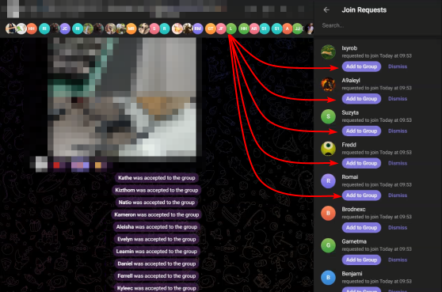

  

 
=EN= 
  A simple Tampermonkey script that will make life easier for Telegram chat owners who use manual (request) member acceptance.  
<ul>
    <li>1. Install the Tampermonkey extension in your browser: 
        PC (Google Chrome) - https://chromewebstore.google.com/detail/tampermonkey/dhdgffkkebhmkfjojejmpbldmpobfkfo; 
        Mobile (Mozilla) - https://addons.mozilla.org/ru/android/addon/tampermonkey/;</li>
    <li>2. Right-click on the Tampermonkey icon and select «Control Panel»;</li>
    <li>3. Click «Create a new script», there will be an icon in the form of «+»;</li>
    <li>4. Copy the contents of the file «<a href="/Auto%20Accept%20Telegram%20Group%20Requests.user.js">Auto Accept Telegram Group Requests.user.js</a>» or just download this file and add it to your Tampermonkey;</li>
    <li>5. Open the web version of Telegram at the link - https://web.telegram.org/k/;</li>
    <li>6. Go to your chat where you need to Accept all requests to join;</li>
    <li>7. Enjoy how the script does everything for you!</li>
</ul>
This script works only on the English version of Telegram! Be careful!   
=RU= 
Простой скрипт Tampermonkey, который облегчит жизнь владельцам чатов Telegram, использующим ручное (запросное) принятие участников.  
<ul>
    <li>1. Установите расширение Tampermonkey в свой браузер: 
        ПК (Google Chrome) - https://chromewebstore.google.com/detail/tampermonkey/dhdgffkkebhmkfjojejmpbldmpobfkfo; 
        Мобильная версия (Mozilla) - https://addons.mozilla.org/ru/android/addon/tampermonkey/;</li>
    <li>2. Щелкните правой кнопкой мыши по иконке Tampermonkey и выберите «Панель управления»;</li>
    <li>3. Нажмите «Создать новый скрипт», там будет иконка в виде «+»;</li>
    <li>4. Скопируйте содержимое файла «<a href="/Auto%20Accept%20Telegram%20Group%20Requests.user.js">Auto Accept Telegram Group Requests.user.js</a>» или просто скачайте этот файл и добавьте его в свой Tampermonkey;</li>
    <li>5. Откройте веб-версию Telegram по ссылке - https://web.telegram.org/k/;</li>
    <li>6. Перейдите в свой чат, где вам нужно Принять все запросы на присоединение;</li>
    <li>7. Наслаждайтесь тем, как скрипт все делает за вас!</li>
</ul>
Данный скрипт работает только на английской версии Telegram! Будьте !
